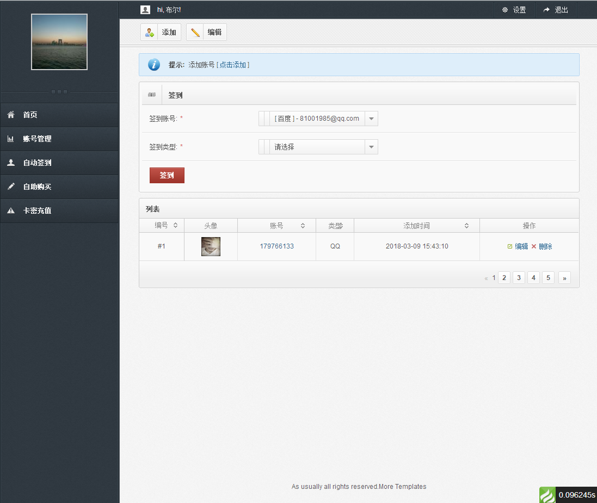
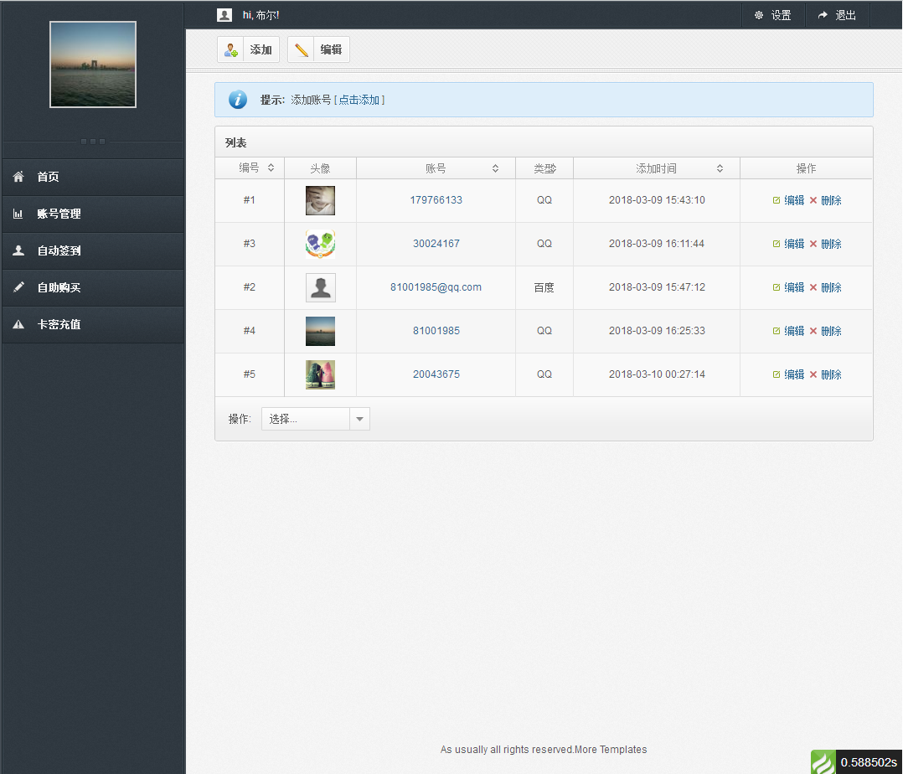
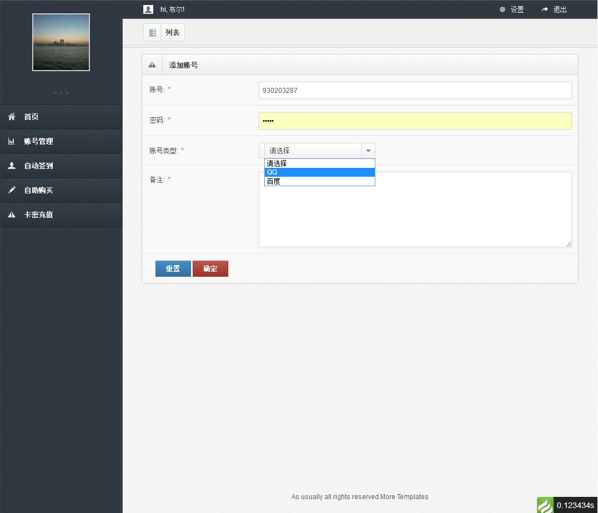
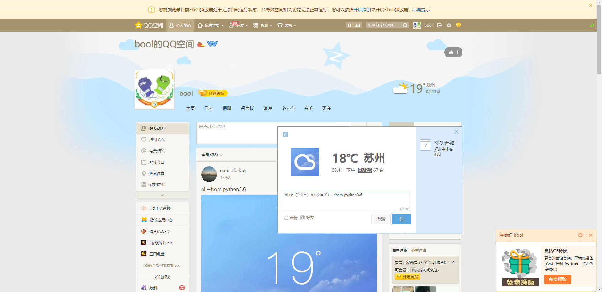
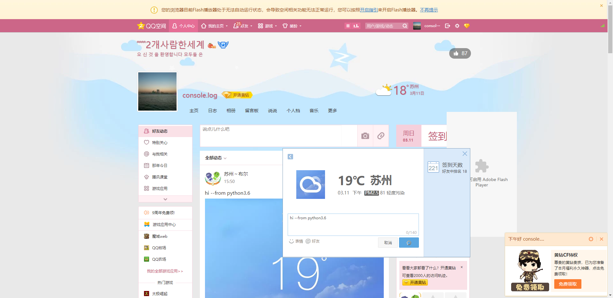
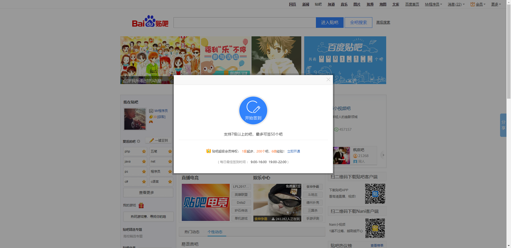

# 云签到系统

基于 ThinkPHP 5 + Flask (Python) 开发的签到管理系统。

## 技术栈

| 分类 | 技术 |
|------|------|
| 后端框架 | ThinkPHP 5.0 |
| 数据库 | MySQL |
| 底层服务 | Flask + Python 3.6 |
| 自动化 | Selenium (Chrome Driver) |

## 项目结构

```
yun-sign/
├── app/                    # ThinkPHP 应用目录
│   ├── index/             # 前台模块
│   │   ├── controller/    # 控制器
│   │   │   ├── Index.php    # 首页
│   │   │   ├── Login.php    # 登录
│   │   │   ├── User.php     # 用户
│   │   │   ├── Account.php  # 账户
│   │   │   ├── App.php      # 应用
│   │   │   ├── Pay.php      # 支付
│   │   │   └── Text.php     # 文本
│   │   ├── model/         # 数据模型
│   │   ├── service/       # 业务服务层
│   │   ├── validate/      # 数据验证
│   │   └── view/          # 视图模板
│   ├── config/           # 应用配置
│   └── extra/            # 扩展配置
├── public/               # 入口文件和静态资源
├── flask/                # Python 签到服务
│   ├── ext/             # 扩展模块
│   │   ├── qzone.py     # QQ空间签到
│   │   └── tieba.py     # 贴吧签到
│   ├── screenshot/       # 演示截图
│   └── app.py           # 主程序
├── demo/                 # 演示截图
└── db.sql               # 数据库文件
```

## 功能模块

### 后台管理 (ThinkPHP)

| 模块 | 说明 |
|------|------|
| 用户管理 | 用户注册、登录、权限管理 |
| 账户管理 | 签到账户添加、编辑、删除 |
| 应用管理 | 签到应用配置 |
| 支付模块 | 会员充值、订单管理 |

### 自动化签到 (Flask + Selenium)

| 功能 | 说明 |
|------|------|
| QQ空间签到 | 自动签到获取积分 |
| 百度贴吧签到 | 自动签到升级 |
| 截图演示 | 自动截图留存 |

## 快速开始

### 1. 环境要求

- PHP 5.6+
- MySQL 5.5+
- Python 3.6+
- Selenium Chrome Driver

### 2. 安装配置

```bash
# 导入数据库
mysql -u root -p < db.sql

# 配置 ThinkPHP
# 修改 app/database.php 数据库配置

# 启动 Flask 服务
cd flask
python app.py
```

### 3. 访问系统

- 后台地址：`http://your-domain/`
- Flask API：`http://your-domain:5000/`

## 目录说明

| 目录 | 说明 |
|------|------|
| `app/index/controller` | 控制器层，处理请求 |
| `app/index/model` | 模型层，数据操作 |
| `app/index/service` | 服务层，业务逻辑 |
| `app/index/validate` | 验证层，数据验证 |
| `app/index/view` | 视图层，模板渲染 |
| `flask/ext` | Python 扩展，实现自动化 |

## 演示截图

### 后台管理




### 自动化签到




## 依赖

### PHP 依赖

- ThinkPHP 5.0
- PHP Redis 扩展

### Python 依赖

- Flask
- Selenium
- requests
